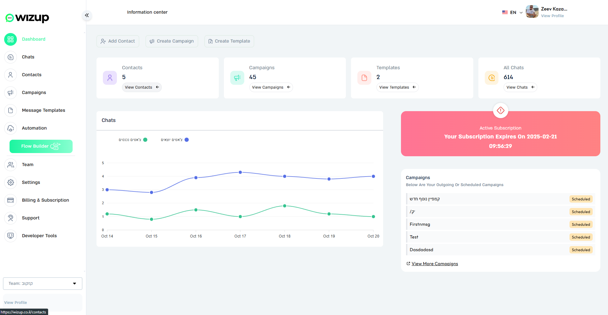
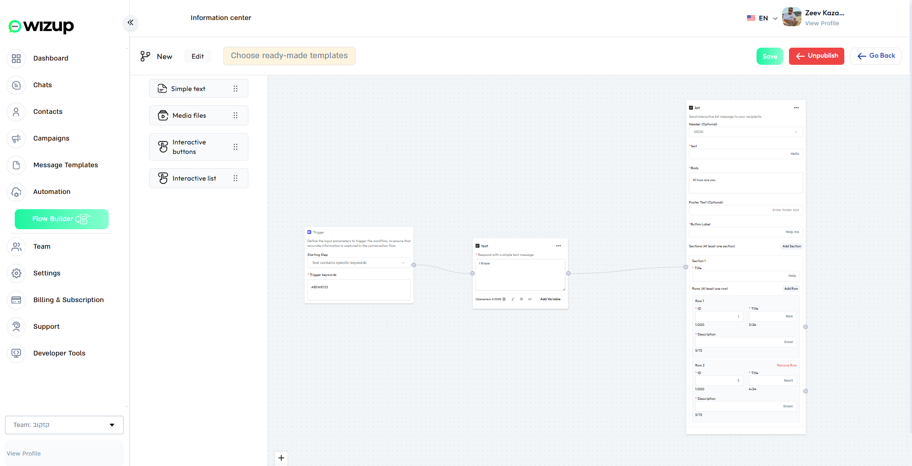
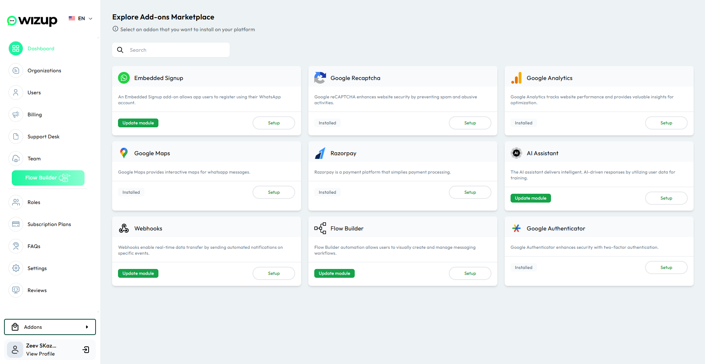

# WizUp

WizUp is a powerful platform designed to integrate business **WhatsApp accounts** with automation capabilities. Built with **Laravel 8, Vue 3, and PHP 8.0**, it allows users to create **message flows, use a flow builder, and integrate AI for automated replies**. Organizations can onboard team members to collaborate and manage customer interactions efficiently.

## Preview

---

## 🛠 Tech Stack & Versions

- **Backend:** Laravel 8, PHP 8.0
- **Frontend:** Vue 3
- **Database:** MySQL
- **Admin Panel:** Custom Built
- **Server:** Cloudways
- **Others:** JavaScript, GitHub, AI Integrations

---

## 📌 Technology Overview

- **Front End:** Vue 3
- **Back End:** Laravel 8 (PHP 8.0)
- **Database:** MySQL
- **Hosting:** Cloudways
- **AI Integration:** AI-powered message responses

---

## 🎯 Features

### **💬 WhatsApp Business Integration**
- Connect and manage WhatsApp Business accounts.
- Automate replies using AI.
- Monitor and manage customer interactions.

### **🔧 Flow Builder**
- **Simple Flow**: Create basic automated responses.
- **Advanced Flow Builder**: Design complex workflows using drag-and-drop UI.
- **AI-powered Replies**: Train AI to respond dynamically based on message context.

### **🏢 Organization & Team Management**
- Add and manage multiple **organizations**.
- Invite and assign **team members** with different roles.
- Track team activity within WhatsApp conversations.

---

## 🌍 External Integrations
- **WhatsApp API** – Official WhatsApp Business account integration.
- **AI Chatbot** – Automate responses using AI models.
- **Cloudways** – Scalable and managed hosting.
- **Webhooks & API** – Extend functionalities with third-party apps.

---

## 🚀 Setting Up Local Environment & Prerequisites

### **📂 GitHub Repo Structure**
- **Master:**  Live Server
- **Develop:**  Dev Server
- **Branch from Develop:** Task-wise branches

---
## Developer Information

- **Developer Email:** izhan47@gmail.com
- **Developer Website/Support:** [izhan.me](https://izhan.me)
